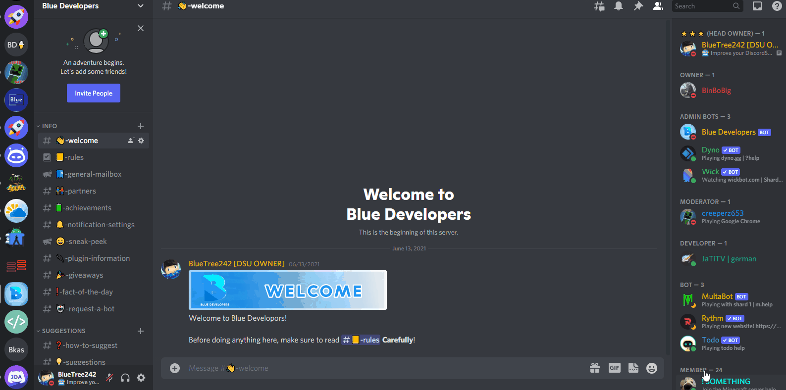
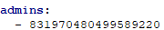

# Welcome to DiscordSRVUtils Wiki!

We work hard to make the plugin very easy as we can. Here we explain how to do everything, and anyway everything is easy!

# How to install
1. Download [DiscordSRV Plugin](https://www.spigotmc.org/resources/discordsrv.18494/) and drop it into your plugins folder
2. Restart your server, and follow the DiscordSRV Installation steps
3. Drop [DiscordSRVUtils](https://www.spigotmc.org/resources/discordsrvutils.85958/) into your plugins folder
4. Configure the plugin, in most cases you need to have admin

# How to get Admin
Its very simply, before the steps make sure this is on

1. Go into your `config.yml` of DiscordSRVUtils
2. the first option would be the admins, Add your Discord ID in or a role ID
3. Reload the plugin using `/dsu reload` and make sure you have the permission `discordsrvutils.reload` 

    

> ⚠ Whoever is in the list of admins or have a role that is in list of admins have access to everything in the plugin (in discord)

# How to Disable Discord Commands

1. Go to `config.yml`
2. Scroll until you find `disabled-commands`, add commands you want to disable
3. Reload the plugin using `/dsu reload` and make sure you have the permission `discordsrvutils.reload`  
   
    

  
!!! info 
    It will be removed from slash command list, those commands disabled will be as if they don't exist

!!! warning
    ⚠ Please do not use aliases.

# Requirements

- DiscordSRV.
- Minecraft version from 1.8 -> 1.19 (new versions should work without new dsu updates)

# Optional Permissions

- Ban Members (For Punishment Sync)
- Manage Server (for detecting invititers)
- Manage Channels (For ticket creation)
- Manage Roles (for welcomer role, and syncing mutes and ban role)

# How we store data

In a database, hsqldb or mysql(or mariadb). hsqldb is default

