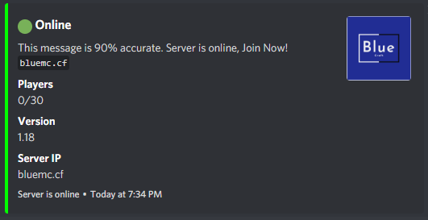

# First, let's take an example on how it look like

# How it works?
It sends a message in discord channel that updates every X of time, full placeholder support, they can also be updated thru events, so the message is never missing anything

# How to enable it
Use the `/status` command, and mention the channel, for example `/status #server-status`

# How to find events

!!! warning
    Not all plugin events can be captured by this plugin, only those that use the Bukkit API.

Ask the developer of plugin about this, events from bukkit (that have no plugins for it) please ask in our [support discord](https://discordsrvutils.xyz/support)

# How to change the message

For online message, go into `plugins/DiscordSRVUtils/messages/status-online.json` this is the [json of the message](messages.md)

For offline message, go into `plugins/DiscordSRVUtils/messages/status-offline.json` ⚠ this one does not support PlaceholderAPI

# Compatibility with other plugins

The only current known problem is when you use premium/super vanish and don't want vanished players to show up, in this case you need PlaceholderAPI

Replace `${#server.getOnlinePlayers().size()}` with `%premiumvanish_playercount%` or with `%supervanish_playercount%` (depending on what you use)

# Update Delay

The time to update the status message (without events), in seconds, shouldn't be lower than 1 minute as of discord rate limits

# How to disable leveling?
Simply run `/status` with no options.

